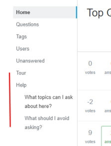

# SEHelpLinks

## Stack Exchange Help Links Chome Extension

[Get it here!](https://chrome.google.com/webstore/detail/stack-exchange-help-links/ckpachebenneicjfndebehniipdlhncc)

Adds useful help links to all Stack Exchange and Stack Overflow sites:

This simply links to a few useful pages within the sites themselves, which are otherwise not very well advertised

Chrome extension icon courtesy of https://icons8.com 

Cheap and cheerful 😊 implementation of the idea proposed at https://meta.stackexchange.com/q/344565/
